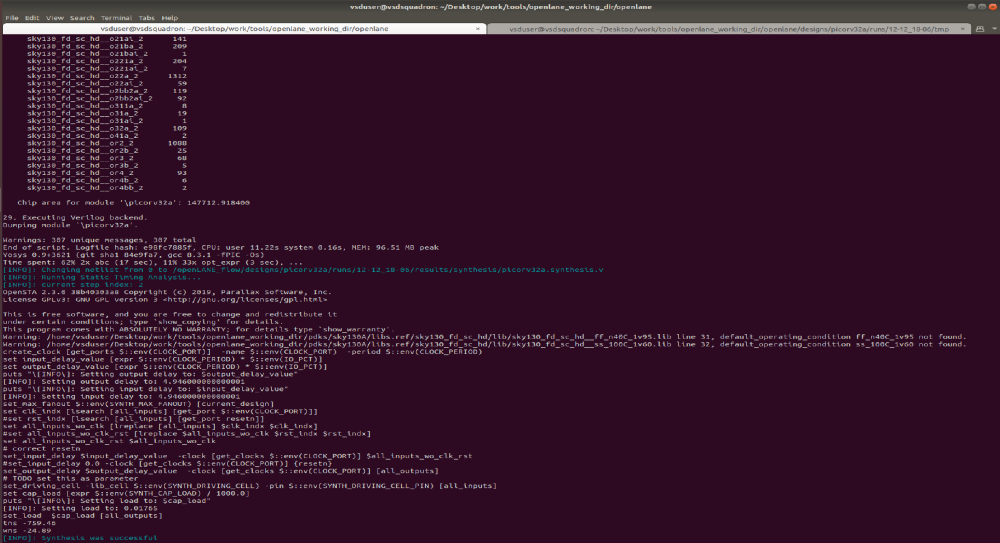

<h1> Digital VLSI SoC Design and Planning by VSD </h1>
<h2> Introduction </h2>

This is my repo for the VSD course [Digital VLSI SoC Design](https://vsdsquadron.vlsisystemdesign.com/digital-vlsi-soc-design-and-planning/) on PnR using OpenLANE and SkyWater PDK. The course covers floorplanning and standard cell design, designing and characterizing a library cell, pre-layout timing analysis and clock tree synthesis, all using opensource tools for the SkyWater 130nm process. This repo will contain the notes I take, and the screenshots and the files generated while doing the tasks assigned, both for my own and for anyone else's reference.

<details>
<summary> <h3>Notes</h3> </summary>
  
</details>

<details>
<summary> <h3>Labs</h3> </summary>
<details>
<summary> <h4>Day 1 - Calculate Flop-Ratio of Design</h4> </summary>
The task given for day 1 is to calculate the flop-ratio of an existing design. For this, the design (a verilog design) has to be prepared and synthesized. Topics learned:
  
* OpenLANE directory structure
* Running OpenLANE
* Synthesizing designs with OpenLANE

&nbsp;

<h4>Steps</h4>

1. The directory containing OpenLANE is cd'ed to, using the command: 

```bash
cd ~/Desktop/work/tools/openlane_working_dir/openlane
```

2. The script to enter the interactive shell of the docker container containing openLANE has been aliased to the alias given below. This has to be run next:

```
docker
```

3. Now that we have entered the shell of the container, we run openLANE. OpenLANE can be run in two modes: autonomous or interactive. Interactive lets you go step-by-step, autonomous automates the intermediary steps. We run openLANE in interactive mode here by running the script:
```
./flow.tcl -interactive
```
&ensp; &ensp; &ensp; This opens a tcl shell that accepts tcl commands.

4. Required package is loaded with the tcl command:

```tcl
package require openlane 0.9
```

<p align="center">
  
  4.1 The terminal with the commands till now.
</p>

5. Synthesis is to be done next. An existing design, PicoRV32A, from the openLANE designs folder is to be synthesized. For this to be done, the data is to be "prepared" first. OpenLANE expects the required files in specific locations. This filesystem is created from the design using the command:
```tcl
prep -design picorv32a
```

&ensp; &ensp; &ensp; This creates a new folder titled 'runs' in the picorv32a folder with the required file structure and file formats.
<p align="center">
  
  5.1 The preparation step.
</p>
<p align="center">
  
  5.2 The newly created folder and its subfolders.
</p>

 6. Now, the design is ready to be synthesized. The following command runs both Yosys and ABC on the design:
```tcl
run_synthesis
```
<p align="center">
  
  6.1 Successful synthesis.
</p>

7. Successful synthesis generates a netlist and various reports in the '<openlane>/designs/picor32va/' 

<p align="center">
  
  6.2 The generated results.
</p>

<p align="center">
  
  6.3 The cell counts, dfxtp_2 represents DFF.
</p>

Here, the number of cells is 14,876 and the number of DFF cells is 1613. Hence, the flop ratio is:
```math
{No. of DFF cells\over Total no. of &nbsp; cells}= \frac{1613}{14876} = 0.108429685
```
</details>
</details>


